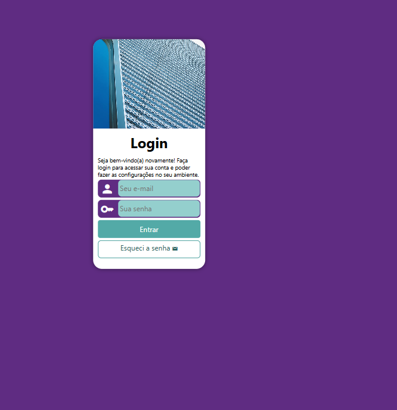

# 🔐 Projeto Login

---

Uma tela de login responsiva, desenvolvida durante os estudos de HTML5 e CSS3 no curso do Curso em Vídeo, com foco em boas práticas de estruturação, estilização e adaptação para diferentes dispositivos.

O projeto simula uma interface real de autenticação — muito comum em sistemas web — servindo como base para estudos e projetos futuros.

## 👀 Preview do Projeto

**💻 Desktop**

**📱 Mobile**

## 🌐 Acesse o Projeto

👉 [Clique aqui para acessar o site!](https://devsandrobatista.github.io/projeto-login/)

## 🎯 Objetivo do Projeto

**O projeto foi desenvolvido com foco em:**

- Praticar HTML5 semântico
- Trabalhar com CSS3 moderno
- Criar um layout de login simples, limpo e funcional
- Aplicar conceitos de **responsividade** para diferentes tamanhos de tela
- Simular uma interface real utilizada em sistemas web

⚠️**Observações:** Este projeto não possui validação ou autenticação real — o foco é **visual e estrutural**.

## 🛠️ Tecnologias Utilizadas

- HTML5
- CSS3
- Media Queries
- Layout Responsivo
- Float

## 📂 Estrutura do Projeto

     projeto-login/ 
     ├── 📂 assets 
     │ ├── 📂 css 
     │ │ ├── 📄 mediaqueries.css 
     │ │ ├── 📄 reset.css 
     │ │ └── 📄 style.css 
     │ └── 📁 images
     ├── 📄 .gitattributes 
     ├── 📄 index.html 
     ├── 📄 LICENSE 
     └── README.md

## 🚀 Como Executar o Projeto

Não é necessário instalar nenhuma dependência.

**Passos:**

1.  Clone o repositório:

        git clone https://github.com/devsandrobatista/projeto-login.git

2.  Acesse a pasta do projeto:

         cd projeto-login

3.  Abra o arquivo index.html diretamente no navegador
    ou
    use uma extensão como Live Server no VS Code para melhor experiência.

## 🖥️ Uso / Funcionalidades

- Campos de usuário/email e senha
- Botão de login ilustrativo
- Layout adaptável para desktop e dispositivos móveis

**Ideal para:**

- Estudos iniciais em Front-end
- Portfólio de projetos básicos
- Referência de estrutura HTML + CSS

## 📚 Créditos

Projeto desenvolvido com base no conteúdo educacional do [CursoemVídeo](https://www.youtube.com/@cursoemvideo)

**Professor:** [Gustavo Guanabara](https://github.com/gustavoguanabara)

**Curso:** [HTML5 e CSS3: modulo 4 de 5](https://www.cursoemvideo.com/curso/curso-html5-e-css3-modulo-4-de-5-40-horas/)

## 📄 Licença

Este projeto está sob a licença MIT.

Sinta-se livre para estudar, modificar e reutilizar.
